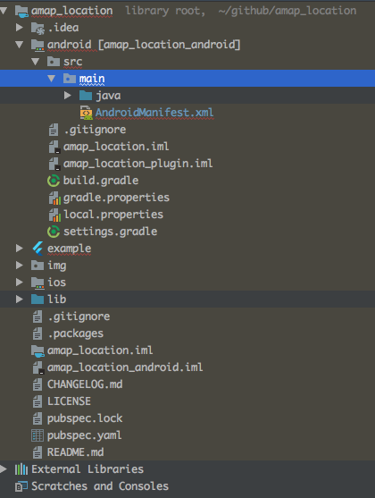

 在上一篇文章[从头开发一个Flutter插件（一）开发流程](https://juejin.im/post/5bdfa3d151882534d44e1eca)里具体介绍了flutter插件的具体开发流程，从创建项目到发布。接下来将会为[Flutter天气](https://github.com/KinsomyJS/muses_weather_flutter)项目开发一个基于高德定位sdk的flutter定位插件。

 完整代码在git仓库里 https://github.com/KinsomyJS/location_plugin

## 申请key
 首先先进入到[高德地图定位sdk文档](https://lbs.amap.com/api/android-location-sdk/locationsummary/)内下载定位sdk，并按要求申请app key,这里不多做介绍，文档已经很详细了

## 配置环境
 sdk文档里同样有关于配置工程的demo,但是因为flutter 插件项目不是一个android工程，所以会有所区别。大致分以下几步：

### 1.集成远程依赖
```
compile 'com.amap.api:location:latest.integration'
```

### 2.配置app key
在AndroidManifest.xml的application标签中配置Key：
```xml
<meta-data android:name="com.amap.api.v2.apikey" 
    android:value="您的Key">
</meta-data>
```

### 3.声明service
在application标签中声明service组件：

```xml
<service android:name="com.amap.api.location.APSService"></service>
```
### 4.声明权限



flutter插件的目的就是隔离对sdk native code的实现，让使用者直接使用dart代码就可以获得到sdk提供的定位信息，插件和使用者交互的代码是在libs下的dart文件中提供的接口。
插件的android文件夹下面是一个完整的android工程结构，我们在这个工程下完成上述的四步。唯一一点不同的是，**配置app key**利用gradle里的manifestPlaceholders属性为用户预留，让用户自己来填写。

于是**配置app key**改写成：
```xml
<meta-data
    android:name="com.amap.api.v2.apikey"
    ndroid:value="${LOCATION_APP_KEY}"/>
```

这个**LOCATION_APP_KEY**，使用者使用插件的时候在自己flutter项目的android工程下的app/build.gradle文件里填写自己申请的高德key即可。
```gradle
android {
    compileSdkVersion 27

    lintOptions {
       ...
    }

    defaultConfig {
        ...
        manifestPlaceholders = [
                LOCATION_APP_KEY : "b947abf0a6820efedc65d06428f14281", /// 高德地图key
        ]
    }
}
```

到目前为止，一个基于高德sdk的定位插件工程就算配置好了，下面就是实现部分。


## 实现
flutter 插件最终暴露给插件使用者的是dart代码的接口，使用者不再需要关心Android和Ios平台上的代码，在定位插件项目中，唯一需要配置的就是上文所说的高德开放平台的app key.

因为现在是将特定平台的sdk开发成插件供flutter app使用，其实就可以理解在Android或者ios平台正常开发项目，将flutter app需要的数据传递过去，flutter插件只是在特定平台的实现上做了一次封装与隔离，封装了dart接口，隔离了两个不同平台实现的差异。

理解这个概念，写出一个flutter插件就变得很容易了，dart和java之间的相互通信在前面写的一篇文章[Flutter探索与实践](https://juejin.im/post/5ba9a74ce51d450e99432608)中**Flutter和原生互相通信**一节讲述过，这里就直接上手展示源码。

### Java部分
java部分的代码写在了**AmapLocationPlugin.java**类下面，它分别实现了MethodChannel.MethodCallHandler, EventChannel.StreamHandler。并且在registerWith方法调用的实例化MethodChannel和EventChannel。

```java
final MethodChannel methodChannel = new MethodChannel(registrar.messenger(), "plugin.kinsomy.com/methodchannel");

final EventChannel eventChannel = new EventChannel(registrar.messenger(), "plugin.kinsomy.com/eventchannel");
```

* 重写MethodChannel.MethodCallHandler的**onMethodCall**方法接受dart代码的方法调用

```java
	@Override
	public void onMethodCall(MethodCall call, Result result) {
		if (call.method.equals("startLocation")) {
			//启动定位
			mLocationClient.startLocation();
		} else if (call.method.equals("stopLocation")) {
			//停止定位
			mLocationClient.stopLocation();
		} else if (call.method.equals("getLocation")) {
			result.success(mLocation);
		} else {
			result.notImplemented();
		}
	}

```

* 重写EventChannel.StreamHandler的**onListen**，该方法携带了一个EventChannel.EventSink实例，通过该实例对象可以调用mEventSink.success()向dart传递数据流，也就是插件里的定位信息

```java
        @Override
	public void onListen(Object o, EventChannel.EventSink eventSink) {
		this.mEventSink = eventSink;
	}
```

* 通过高德sdk的AMapLocationClient获取到定位信息，并将其封装成json字符串供dart调用。


### dart部分

dart部分的代码在项目根目录lib文件夹下的amap_location_plugin.dart文件。

* 在构造函数里实例化和java代码中同样channel name的MethodChannel与EventChannel
```dart
factory AmapLocation() {
    if (_instance == null) {
      final MethodChannel methodChannel =
          const MethodChannel('plugin.kinsomy.com/methodchannel');
      final EventChannel eventChannel =
          const EventChannel('plugin.kinsomy.com/eventchannel');
      _instance = AmapLocation.private(methodChannel, eventChannel);
    }
    return _instance;
  }
```

* 提供接口方法开始定位startLocation和对应的停止定位

```java
Future<void> get startLocation =>
      _methodChannel.invokeMethod("startLocation");
```

* 实例化Stream接受event返回的定位数据
```dart
Stream<String> _onLocationFetched;
_onLocationFetched =
        _eventChannel.receiveBroadcastStream().map((dynamic event) => event);
```


这样一个基于高德定位sdk的flutter定位插件就算完成了，在example里写一个demo实际测试一下。


**目前这个插件还是个简易版本，未来希望能加上地图，导航，线路规划等一系列的功能**

## [项目地址](https://github.com/KinsomyJS/location_plugin),欢迎贡献代码和issue，喜欢可以给个star～





    
 


