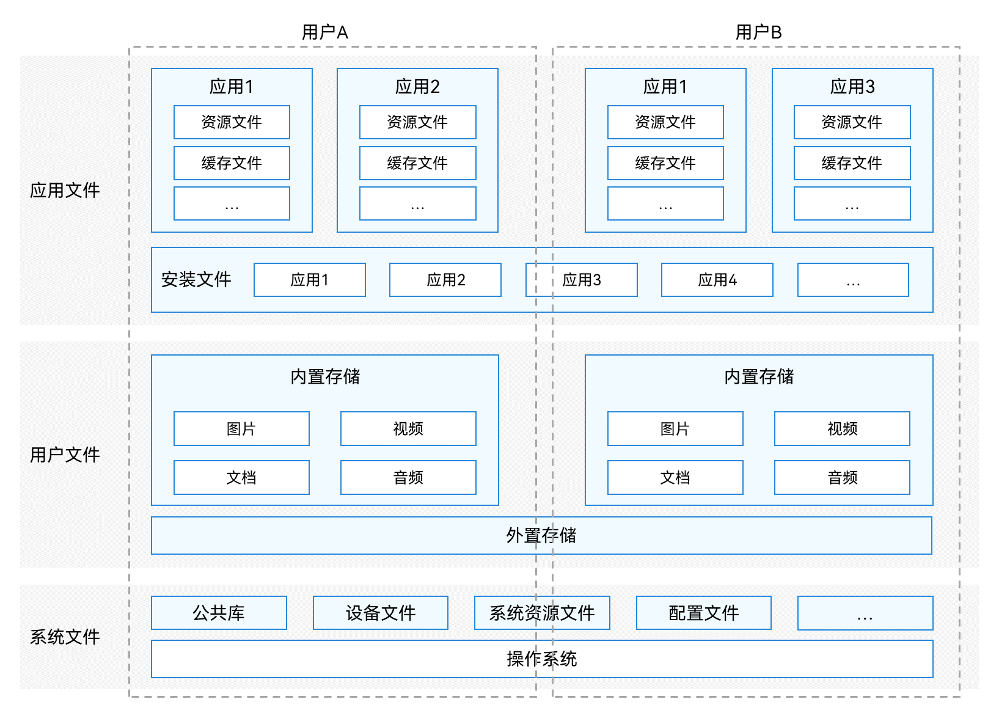
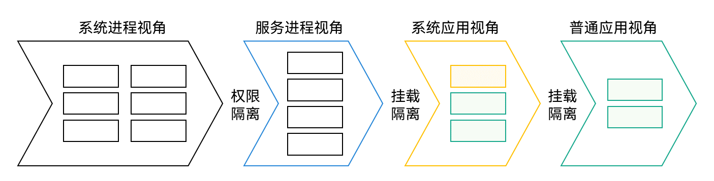
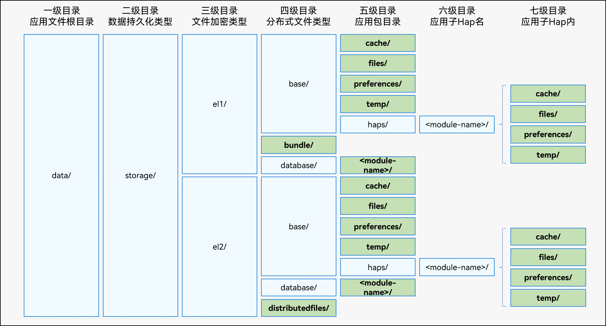
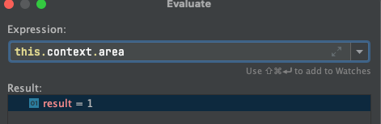
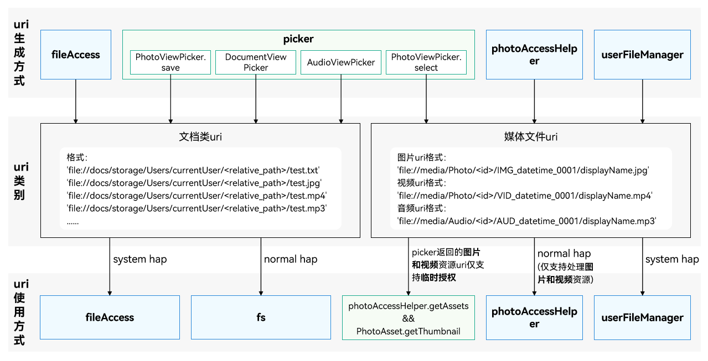

## 基本概念
### 文件分类
#### 按数据结构可以分两类：
* 结构化数据文件：数据库
* 非结构话数据文件：文档、媒体文件

#### 按文件权限范围分类
* 应用文件：文件所有者为应用，包括应用安装文件、应用资源文件、应用缓存文件等。
* 用户文件：文件所有者为登录到该终端设备的用户，包括用户私有的图片、视频、音频、文档等。
* 系统文件：与应用和用户无关的其他文件，包括公共库、设备文件、系统资源文件等。这类文件不需要开发者进行文件管理，本文不展开介绍。



#### 文件系统按存储位置分配
* 本地文件系统
* 分布式文件系统

## 应用文件
### 沙箱机制
沙箱机制用于数据安全隔离，避免数据遭到随意访问，操作系统会为每个应用开辟出一个“应用沙箱目录”。应用可以在用户授权后，操作应用沙箱目录下的文件。

### 应用沙箱路径
沙箱机制和Android得分区存储有所区别

应用沙箱路径是在沙箱机制下生成的逻辑路径，屏蔽了文件存放的真实物理路径，有一个映射关系。

开发者的hdc shell环境进入文件系统等同于系统进程，能看到文件真实物理路径，而在应用内使用文件api访问，只能获取到应用沙箱路径。


### 应用文件目录结构


* 禁止直接使用上图中四级目录之前的目录名组成的路径字符串，否则可能导致后续应用版本因应用文件路径变化导致不兼容问题。
* 通过Context属性获取应用文件路径，包括但不限于上图中绿色背景的路径。 

属性  	    				| 路径
------------------------- 	| -------------
bundleCodeDir 	| <路径前缀>/el1/bundle
cacheDir	| <路径前缀>/<加密等级>/base/cache
filesDir	| <路径前缀>/<加密等级>/base/files
preferencesDir |	<路径前缀>/<加密等级>/base/preferences
tempDir	| <路径前缀>/<加密等级>/base/temp
databaseDir |	<路径前缀>/<加密等级>/database
distributedFilesDir |	<路径前缀>/el2/distributedFiles

#### 文件加密级别
上图中的三级目录是文件加密级别，总共有4级，常用的为EL1和EL2
* EL1：对于私有文件，如闹铃、壁纸等，应用可以将这些文件放到设备级加密分区（EL1）中，以保证在用户输入密码前就可以被访问。
* EL2：对于更敏感的文件，如个人隐私信息等，应用可以将这些文件放到更高级别的加密分区（EL2）中，以保证更高的安全性。
* EL3：对于应用中的记录步数、文件下载、音乐播放，需要在锁屏时读写和创建新文件，放在（EL3）的加密分区比较合适。
* EL4：对于用户安全信息相关的文件，锁屏时不需要读写文件、也不能创建文件，放在（EL4）的加密分区更合适。

可以按照需要在操作文件api之前指定对应的访问文件级别，默认为**EL2级**



``` typescript
    // 存储普通信息前，切换到EL1设备级加密
    this.context.area = contextConstant.AreaMode.EL1; // 切换area
```

#### 应用沙箱路径和真实物理路径的对应关系
| 应用沙箱路径 | 物理路径 | 说明 |
|-------|-------|-------|
| /data/storage/el1/bundle | /data/app/el1/bundle/public/<PACKAGENAME> | 应用安装包目录 |
| /data/storage/el1/base | /data/app/el1/<USERID>/base/<PACKAGENAME> | 应用el1级别加密数据目录 |
| /data/storage/el2/base | /data/app/el2/<USERID>/base/<PACKAGENAME> | 应用el2级别加密数据目录 |
| /data/storage/el1/database | /data/app/el1/<USERID>/database/<PACKAGENAME> | 应用el1级别加密数据库目录 |
| /data/storage/el2/database | /data/app/el2/<USERID>/database/<PACKAGENAME> | 应用el2级别加密数据库目录 |
| /data/storage/el2/distributedfiles | /mnt/hmdfs/<USERID>/account/merge_view/data/<PACKAGENAME> | 应用el2加密级别有帐号分布式数据融合目录 |


## 用户文件
应用文件的路径是按文件夹路径拼接而成，然而用户文件是以uri形式访问，uri是file协议，用户文件的路径都是file:// 开头


上图可以看到用户文件有两个类别：

### 文档类文件uri
  uri格式为 file://docs/storage/Users/currentUser/<relative_path>/filename


### 媒体文件uri
  - 图片uri格式：'file://media/Photo/<id>/IMG_datetime_0001/displayName.jpg'
  - 视频uri格式：'file://media/Photo/<id>/VID_datetime_0001/displayName.mp4'
  - 音频uri格式：'file://media/Audio/<id>/AUD_datetime_0001/displayName.mp3'


## 实际案例
使用场景：在web里面前端通知鸿蒙原生进行相册图片选择或拍照，然后将本地图片返回给web显示

```ts
/**
   * 相册选择图片
   * @param params
   */
  takePicture(params: string) {
    console.log("UpimeNativeApi takePicture", params);
    let paramsArr: Array<number | string[] | string> = JSON.parse(params);
    if (paramsArr.length != 3) {
      return;
    }
    let clbJsFunc = paramsArr[2] as string;
    let PhotoSelectOptions = new picker.PhotoSelectOptions();
    PhotoSelectOptions.MIMEType = picker.PhotoViewMIMETypes.IMAGE_TYPE;
    PhotoSelectOptions.maxSelectNumber = paramsArr[0] as number;
    let photoPicker = new picker.PhotoViewPicker();
    photoPicker.select(PhotoSelectOptions).then((PhotoSelectResult) => {
      console.info('UpimeNativeApi takePicture:' + PhotoSelectResult.photoUris);
      let photoUris = PhotoSelectResult.photoUris;
      let virtualPathArr: string[] = []
      // PhotoViewPicker获取的地址并非应用沙箱路径，需要先将图片复制到应用沙箱路径
      for (let index = 0; index < photoUris.length; index++) {
        const dst = 'file://' + getContext(this).filesDir;
        let sandboxPath = copyFileToApp(photoUris[0], dst)
        // 解决file协议跨域问题，需要构造虚拟域名加载本地沙箱路径image资源
        virtualPathArr.push(FileVirtualUrl + sandboxPath)
      }
      let jsStr = `__record_callback(\"${clbJsFunc}\", ${JSON.stringify(virtualPathArr)});`;
      console.info('UpimeNativeApi takePicture,jsStr:' + jsStr);
      this.webController.runJavaScript(jsStr)
    }).catch((err: BusinessError) => {
      console.error('PhotoViewPicker.select failed with err: ' + err);
    });
  }

  // 复制到沙箱路径
export function copyFileToApp(src: string, dst: string) {
  try {
    let fileArray = src.split("/");
    let fileName = fileArray[fileArray.length-1];
    let file = fileIo.openSync(src, fileIo.OpenMode.READ_ONLY);
    let dstPath = dst + '/' + fileName;
    let file2 = fileIo.openSync(dstPath, fileIo.OpenMode.READ_WRITE | fileIo.OpenMode.CREATE); //先创建有读写权限的文件，再把不可读写的文件复制过来
    fileIo.copyFileSync(file.fd, file2.fd);
    return dstPath;
  } catch (e) {
    console.error("txy copy error")
    return '';
  }
}

Web({ src: this.url, controller: this.webviewController })
  .domStorageAccess(true)
  .javaScriptAccess(true)
  .fileAccess(true)
  .imageAccess(true)
  .onControllerAttached(() => {
    this.registerJSApi()
    this.setUa()
    this.webviewController?.refresh()
  })
  .id("webroot")
  .onInterceptRequest((event) => {
    if (!event) {
      return;
    }
    let fileUri = event.request.getRequestUrl()
    if (fileUri.startsWith(FileVirtualUrl)) {
      fileUri = fileUri.replace(FileVirtualUrl, '');
      let file: fileIo.File;
      file = fileIo.openSync(fileUri, fileIo.OpenMode.READ_WRITE);
      let response = new WebResourceResponse();
      response.setResponseData(file.fd);
      response.setResponseEncoding('utf-8');
      response.setResponseMimeType("image/jpeg");
      response.setResponseCode(200);
      response.setReasonMessage('OK');
      response.setResponseIsReady(true);
      response.setResponseHeader([{ headerKey: "Access-Control-Allow-Origin", headerValue: "*" }])
      return response;
    }
    return null;
  })

```

